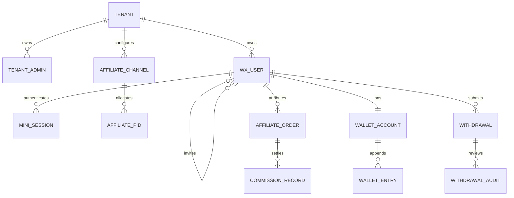

# ER

```mermaid
erDiagram
  TENANT ||--o{ TENANT_ADMIN : owns
  TENANT ||--o{ WX_USER : owns
  WX_USER ||--o{ MINI_SESSION : authenticates
  WX_USER o|--o{ WX_USER : invites
  TENANT ||--o{ AFFILIATE_CHANNEL : configures
  AFFILIATE_CHANNEL ||--o{ AFFILIATE_PID : allocates
  WX_USER ||--o{ AFFILIATE_ORDER : attributes
  AFFILIATE_ORDER ||--o{ COMMISSION_RECORD : settles
  WX_USER ||--|| WALLET_ACCOUNT : has
  WALLET_ACCOUNT ||--o{ WALLET_ENTRY : appends
  WX_USER ||--o{ WITHDRAWAL : submits
  WITHDRAWAL ||--o{ WITHDRAWAL_AUDIT : reviews
```
