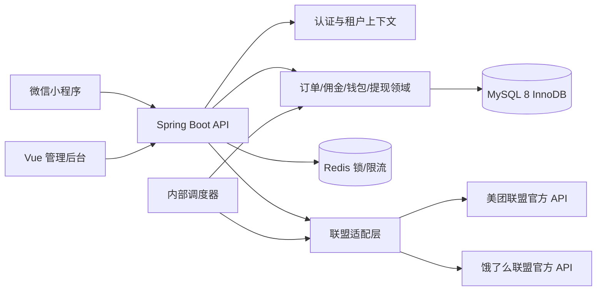

# 系统架构

```mermaid
flowchart LR
  MP[微信小程序] --> API[Spring Boot API]
  ADM[Vue 管理后台] --> API
  API --> AUTH[认证与租户上下文]
  API --> DOM[订单/佣金/钱包/提现领域]
  DOM --> MYSQL[(MySQL 8 InnoDB)]
  API --> REDIS[(Redis 锁/限流)]
  API --> ADAPTER[联盟适配层]
  ADAPTER --> MT[美团联盟官方 API]
  ADAPTER --> EL[饿了么联盟官方 API]
  JOB[内部调度器] --> ADAPTER
  JOB --> DOM
```

所有租户业务查询绑定认证上下文中的 tenantId。联盟凭据加密保存；任务通过 Redis 锁按租户+平台串行化。
