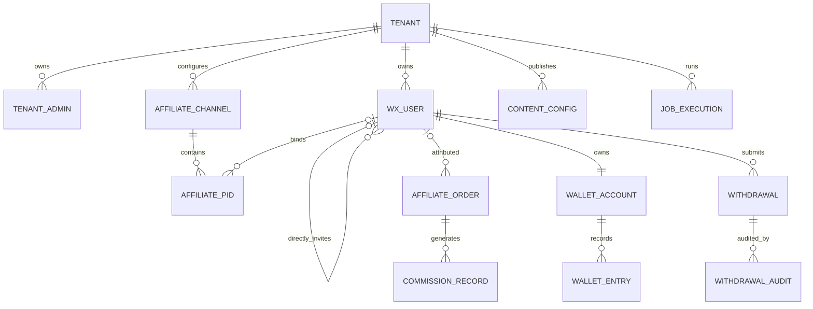

# 数据库 ER 图

```mermaid
erDiagram
 TENANT ||--o{ TENANT_ADMIN : owns
 TENANT ||--o{ WX_USER : owns
 WX_USER o|--o{ WX_USER : directly_invites
 TENANT ||--o{ AFFILIATE_CHANNEL : configures
 AFFILIATE_CHANNEL ||--o{ AFFILIATE_PID : contains
 WX_USER o|--o{ AFFILIATE_PID : binds
 WX_USER o|--o{ AFFILIATE_ORDER : attributed
 AFFILIATE_ORDER ||--o{ COMMISSION_RECORD : generates
 WX_USER ||--|| WALLET_ACCOUNT : owns
 WALLET_ACCOUNT ||--o{ WALLET_ENTRY : records
 WX_USER ||--o{ WITHDRAWAL : submits
 WITHDRAWAL ||--o{ WITHDRAWAL_AUDIT : audited_by
 TENANT ||--o{ CONTENT_CONFIG : publishes
 TENANT ||--o{ JOB_EXECUTION : runs
```
