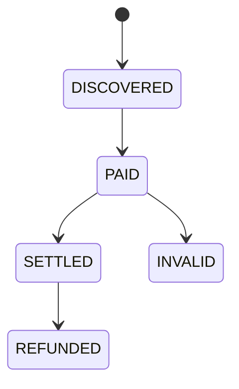

# 订单状态与佣金

订单入库即保存自购和一级奖励比例快照。仅 SETTLED 可结算；同一订单、受益人、奖励类型由唯一索引保证一次。结算在单事务中创建佣金、写钱包流水、更新钱包、标记订单。退款不删原流水，新增负向冲正记录。

## 退款欠款策略

钱包的 `available_cent`、`frozen_cent` 和 `debt_cent` 始终不得为负数。订单退款时，系统先从可用余额扣回已经发放的佣金；如果可用余额不足，差额进入 `debt_cent`，不允许把可提现余额直接写成负数。后续佣金入账时先减少欠款，剩余金额才进入可用余额。`debt_cent > 0` 的用户暂停提现，直至欠款全部还清。

每次冲正和偿债都写入不可变 `wallet_entry`，同时记录可用、冻结、欠款的前后余额和增量。已付款提现不回滚，退款产生的差额通过欠款模型追偿。该策略由 `V5__wallet_debt_model.sql` 和钱包集成测试约束。
