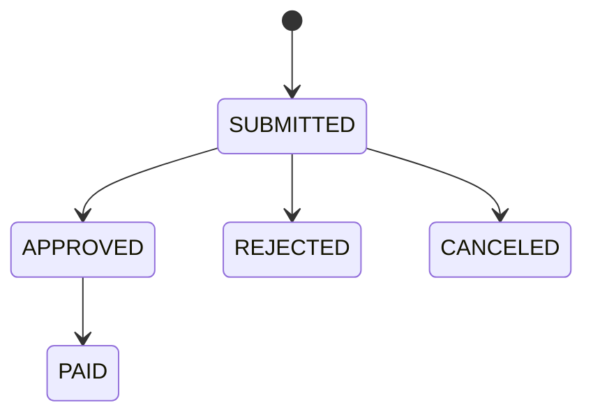

# 提现操作手册

```mermaid
stateDiagram-v2
 [*] --> SUBMITTED
 SUBMITTED --> APPROVED
 SUBMITTED --> REJECTED
 SUBMITTED --> CANCELED
 APPROVED --> PAID
```

提交时校验最低 10 元和可用余额，并原子地从可用转入冻结。管理员二次确认后审核；线下付款后填写渠道、流水号、付款时间和凭证。拒绝/取消原子释放冻结；PAID 不可再次付款。所有转换使用状态条件与 version，并写 withdrawal_audit。
